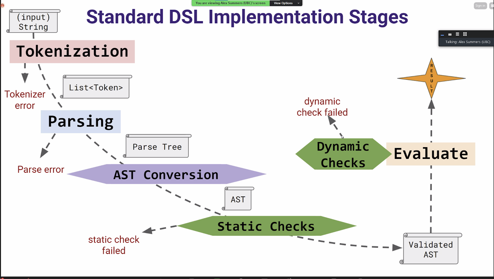

# CHECK-INS

Use this file to commit information clearly documenting your check-ins' content. If you want to store more information/details besides what's required for the check-ins that's fine too. Make sure that your TA has had a chance to sign off on your check-in each week (before the deadline); typically you should discuss your material with them before finalizing it here.

## Check-in 1 Report Items

> What is the high-level purpose of your DSL? What kind of users is it aimed at? What will it enable users to do?

Our DSL proposes to allow non-programmers the ability to easily create digital art. It aims to allow users to describe a scene or animation using our described syntax and have it rendered for them. Users may define a scene containing objects that are pre-defined shapes or a set of custom points, and list fields describing their appearance. They may sequence scenes using the concept of frames which we will then handle animations for. As well, they may reference movements relative to their coordinate frames. This art is not intended to be of high quality/fidelity (more akin to complicated powerpoint shape / animations).

> What are the 2-3 rich features of your DSL? A rich feature should be more complex than a choice in a set (e.g., the ability to choose between colours for a title is not a “rich” feature). What customisation will each feature enable? Which features can be combined to interact in useful or creative ways?

Our rich features include conditionals, functions, and loops. Our use of macro functions will allow users to easily describe what they want to do with certain created scenes (i.e. ANIMATE, PAINT). We plan to implement conditionals by allowing an object (ex. "sky") to change field values based off of pre-existing world variables. We are going to implement loops for the user as they may specify looping animations (i.e. REPEAT macro).

> Example snippets of your DSL that illustrate at least each rich feature, and any interesting interaction between those.

Below is a sample of what our DSL might look like describing a simple image of a sunset.

```
sunset_scene = [image]

image = [foreground, background]

foreground = [dirt, bench]
background = [(sun, (50,70)), (clouds, (0,0)), (sky, (0,0))]

sun = {
  shape: circle,
  size: 20,
  colour: yellow,
}

sky = {
  shape: rectangle,
  colour: {gradient: {top -> bottom, pink -> blue}},
  size: (100,100)
}

clouds = [(cloud1, (10,60)), (cloud2, (30,75))]

cloud1 = {
  shape: cloud,
  colour: white,
  size: (10,15)
}

cloud2 = {
  shape: cloud,
  colour: white,
  size: (15,20)
}

cloud = [cloud_circle1, cloud_circle2, cloud_circle3,]

PAINT sunset_scene

```

Below is an example of what a sunset scene may look like when animated

```
sunset_animation = [frame1, frame2]

frame1 = [(sun, (50,70)), (clouds, (0,0)), (light_sky, (0,0))]
frame2 = [(sun, (50,40)), (clouds, (30,-10)), (dark_sky, (0,0))]

sun = {
  shape: circle,
  size: 20,
  colour: yellow,
}

sky = {
  shape: rectangle,
  colour: IF $current_frame$ = frame1
            THEN {gradient: {top -> bottom, pink -> blue}},
            ELSE black,
  size: (100,100)
}

clouds = [(cloud1, (10,60)), (cloud2, (30,75))]

cloud1 = {
  shape: cloud,
  colour: white,
  size: (10,15)
}

cloud2 = {
  shape: cloud,
  colour: white,
  size: (15,20)
}

cloud = {
  vertices: [(10,20), (15,15), (20, 20) (10, 15)]
}

REPEAT (ANIMATE sunset_animation FOR 30) 2

```

> Note any important changes/feedback from TA discussion.

The TA informed us about a start-up that has a similar product to our current, though utilizes generative AI. As well, they helped us clarify how our ideas related to what key features we could offer. They also recommended us to continue brainstorming features

> Note any planned follow-up tasks or features still to design.

We are considering adding more features that we are still brainstorming in order to increase complexity and improve user experience. As well, we would like to work on making our syntax more readable to the non-programmer as we understand our current examples do resemble code.ch

## Check-in 2 Report Items

> Modular design for the software system: what is the input, output of each component? Who is responsible for each component? Do you want to be jointly responsible for some components?

We will be using the standard DSL implementation stages:

In which:

- ANTLR (Covers Tokenization and Parsing)
  - Input: String
  - Output: List<Token> and Parse Tree
  - Responsibility: Andrew for the initial set up + everyone else to contribute after
- AST Conversion (and Valid Check of AST)
  - Input: Parse Tree
  - Output: Validated AST
  - Responsibility: Collaborative effort (Everyone together + splitting tasks when needed after discussion)
- Evaluation: Together + splitting division when needed after discussion (and Take AST into Python3 TKinter code)
  - Input: Validated AST
  - Output: our result (drawing/animation)
  - Responsibility: Collaborative effort (Everyone together + splitting tasks when needed after discussion)

> What is the data at each interface point? Are there invariants over the data other than the class structure?

- Data at each interface point:
  - Everything as we have mentioned above (and as per the diagram of the standard DSL implementation stages)
    - Tokenization: input of String into List<Token>
    - Parsing: List<Token> to Parse Tree
    - AST Conversion: Parse Tree to AST
    - Static Checks: AST to Validated AST
    - Evaluation: Validated AST to TKinter code (GUI) that displays our animation/drawing (a sequence of images in the same window)
- Invariants:
  - whatever currently is supposed to be displayed must not be null as we must show something (no nullable objects)
  - the coordinate frame of reference never changes
    - EX. (x,y) always remains (x,y) and never flips to (y,x)

> How will you be able to build component X independently? Can you write tests for component X independently of its dependent components?

We will be trying to code collaboratively (for program and tests). We will also be trying to write out the tests together so that we all have the same understanding of the expectations and what we should be doing for each stage.

> Who will be responsible for writing which tests, and when (will the same people write the tests as the code)?

We will be collaboratively writing the tests to understand components and to establish a contract with each other on our expectations. We will be trying to finish the tests for each part in succession (please see roadmap).

> Are there design or other project tasks (possibly including team management), other than these components, that need to be assigned/completed?

Everything else we have listed under the roadmap/timeline below (currently setting our expectations of each other and what we should all be focusing each week). If any other specific tasks/goals need to be completed for each week for the DSL, we will be discussing as a group during our own check in time with each other to assign the tasks (such as the check in report each week).

> Roadmap/timeline(s) for what should be done when, and how you will synchronize/check-in with each other to make sure progress is on-track. Talk clearly with your team members about your expectations for communication and progress, and what you will do as a team if someone falls behind.

This will be our current timeline:

- Jan 23 (check-in 2):
  - [DUE]:
    - Timeline + distribution of work agreements
  - [BEGIN]:
    - Draft DSL syntax and semantics
    - Recruit two users for user study, and conduct
- Jan 30 (check-in 3):
  - [DUE]:
    - User study conducted
  - [BEGIN]:
    - Fully define DSL using ANTLR (together)
    - Define our language’s syntax and semantics
    - Convert definition into input grammar for ANTLR tool
    - Use ANTLR to generate a tokenizer and parser for DSL
- Feb 6 (check-in 4):
  - [DUE]:
    - Tokenizer + Parser (w/ tests for both passing)
  - [BEGIN]:
    - Begin recruitment of two users for another user study, and conduct
    - Begin coding of AST Converter, Static Checks (Semantic analysis)/any required and necessary tests, Evaluator
- Feb 13 (check-in 5):
  - [DUE]:
    - Results from another user study
    - Finish AST Converter, semantic analyzer, tests, and evaluator
  - [BEGIN]:
    - Plans for video of project
    - Making sure that all tests for each component do pass
    - fulfilling any other requirements/fixing any remaining bugs/issues
- Feb 20:
  - [DUE]:
    - Finishing details
    - Video display of project
- Hand in Project by Feb. 26th 9 am

Our current expectations for each other:

- show up and participate in the check in time we set up for each week
- work towards the goals we have set for each other each week
- discuss with the group if any issues come up (to avoid anyone falling behind)
- if someone falls behind, they will have discussed it with the group beforehand so we can all work together in a way that we can all success

> Summary of progress so far.

We are currently completing the following goals:

- parser
- lexer (+ going over what we need to add or change)
- drafting syntax/semantics (+ going over the finalized version of what our DSL should be/look like)
- recruiting users for user study
- spelling, agreeing/acknowledging our expectations of each other and the work for the upcoming weeks
- set up a check in time for the items that we have assigned to each other to complete and to formalize what we have done each week

# Check-in 3 Report Items

> Explain a mockup of your concrete language design (as used for your first user study), including descriptions of both the syntax and what is meant to happen.
> Include the example snippets you used in your user study, and their outputs.

We used the following as an sample of our DSL to teach our partcipants during the user study:

```
Let orange1 be an object with shape = circle, size = 30, colour = orange, rotation = 30 degrees
Let orange2 be an orange1
Let tree be an object with shape = rectangle, colour = #964b00, size = (10,40), owns orange1 at (10,30), rotation = 1 radians
Let canvas be an object with shape = rectangle, colour = (255,255,255), size = (100,100)

Let frame1 be an image on canvas with orange2 at (50,30) and tree at (50,0)
Let frame2 be an    image    on   canvas    with    orange2    at    (50, 0) and tree at (50,0)

IF Assert that orange2 has size = 30
     THEN    ANIMATE frame1 -> frame2 FOR 5 seconds
     ELSE    DRAW frame2
```

Which results in the following two images (frames):


In addition, we explained how the placement of objects works on the canvas. Specifically, we can place things with absolute coordinates which is drawn from the original to the bottom-left of any shape's bounding box or with relative coordinates to another shape.


When performing the user study, we asked them to perform two tasks:

1. Given a sample of our DSL, could they draw the output image?

```
Let fishtail be an object with shape = rectangle, size = (6, 13), colour = blue // size = (width, height)
Let fish be an object with shape = circle, size = 9, colour = orange, owns fishtail at (-6, -2) // size = diameter of circle
Let canvas be an object with shape = rectangle, colour = (173, 216, 230), size = (100,100) // rgb(173, 216, 230) = light blue.

Let frame1 be an image on canvas with fish at (50,50) and fish at (70,80)
Let frame2 be an image on canvas with fish at (60,50) and fish at (90,90)
```

The expected output was:


Our participants constructed these:


2. Lastly, we asked them to write out our DSL given an output image


An example answer (there are many possibilities) is:

```
Let head be an object with shape = circle, size = 20, colour = yellow
Let eyeball1 be an object with shape = circle, size = 4, colour = black
Let eyeball2 be an eyeball1
Let mouth be an object with shape = rectangle, size = (12, 2), colour = red
Let head own eyeball1 at (4, 10), own eyeball2 at (12, 10), and own mouth at (4, 4)

Let torso be an object with shape = triangle, size = (40, 50), colour = purple
Let leg1 be an object with shape = line, size = (4, 10)
Let leg2 be an object with shape = line, size = (4, -10)

Let canvas be an object with shape = rectangle, size = (160, 100), colour = white

Let frame be an image on canvas with head at (70, 66) and torso at (60, 24) and leg1 at (66, 14) and leg2 at (90, 14)

```

Our participants constructed these:

```
Let eye be an object with shape = circle, size = 4, colour = black
Let mouth be an object with shape = rectangle, size = (12,2), colour = red
Let head be an object with shape = circle, size = 20, colour = yellow
Let body be an object with shape = triangle, size  = (40,50), colour = purple
Let leftLeg be an object with shape = line, size = (4,10), colour = black
Let rightLeg be an object with shape = line, size = (4, -10), colour = black

Let canvas be an object with shape = rectangle, colour = white, size = (160, 100)
Let frame1 be an image on canvas with body at (60,24) and leftLeg at (66, 14) and rightLeg at (90, 24) and head at (70, 66) and eye at (74,76) and eye at (82,76) and mouth at (74,70)

```


> Notes about your first user study. What did they find easy/difficult? What did you learn from your user(s)? Is there anything you would have done differently? Can this be done for your final user study?

Overall, both participants found our language straightforward to pick up without too much difficulty related to the language itself and the tasks we presented them.

From our studies we learned that users are naturally curious about some details such as how does rotation work, how does layering shapes work and how might one flip shapes around. For our final user study we will need to fully settle on a design for these and include them in tutorial material so that the user understands these features.

In addition, we made a few minor mistakes with our tutorial examples that may have confused our participants - we will be sure to address these prior to the next study.

> What changes to your language design have you made so far, or are considering?

Feedback from our TA suggested that we need to add a layer of complexity to our language (beyond animating two distinct frames). We intend to allow "chaining" of an arbitrary number of frames together. In addition, through feedback from our user study we will consider adding a visual hierarchy to our language itself. This will allow users to compose objects together in a more natural manner, and allow them to visualize how objects will render on top of one another (in a layered manner).

> How does this affect the example snippets you include here?

Animating scenes was out of scope for our first user study and hence no specific change needs to be made to the examples. In the future we will add more examples that show the added complexity of chaining animations.

For the visual hierarchy, there will likely be a small-medium sized change perhaps using indents to show who owns what (A owns B which in turn owns C):

```
A
  B
    C ...
```

Or we may explore an approach like you see in JSON with nested objects:

```
A: {
  B : {
    C ...
  }
}

```

This is a detail that we will discuss and finalize by the next checkin.

> Any changes to your project timeline/plan that you need to make?

No.

> Are there new tests you can write now, based on your current project status?

Yes, because we have both our Lexer and Parser we could write unit tests.

> How can your snippets be made into unit tests, and for which component(s)?

- **Lexer**: given an input string, outputs the correct number of tokens and has assertions related to token types (similar to Exercise 2 - Turtle).
- **Parser**: given an input string, does it output the correct program (number and order of statements)

> What about planned error handling in your components? Tests for these?

We could write tests that assert errors are thrown. For the Lexer, we could provide input strings that should not parse to a valid program. For the Parser, we could provide an input string that does not logically make sense (for example, using a shape that is not defined, etc.)
  
## Check-in 4 Report Items
  
> Status of implementation. Component-wise progress. Which tests are passing, and which not? Which extra tests still need to be written/made?
  
We have decided to adopt a Test-Driven Development approach and have written the following tests (or should have by the end of the week):
  - Lexer Tests
  - Parser Tests
  - Evalutor Tests
  - Semantic Checks (Static Checks)

Tests that are currently passing (or should be by the end of the week) include:
  - Lexer Tests
  - Parser Tests
  
We also plan to have our AST implementation done by this week. Since we are using ANTLR, the implementation of our Lexer and Parser is finished. We have not started implementation on the Evaluator.
  
Some tests we plan to develop in the future include:
  - Dynamic Checks
  - Integration Tests
  - End-to-End Tests
  
> Plans for final user study. Are there any major differences from the previous one? If so, what are the reasons?

There are currently no planned major changes with how our final user study will be conducted. However, users will be using an updated and improved version of our DSL.

> DSL changes from user study feedback

From the last check-in, we discussed our users pointing out that there was no clear way to define a hierarchy and layering between objects of the same parent. Thus we have decided to add a Z coordinate in how object position is defined.
  
eg. 
  ```
  Let child1 be an object with shape = circle, size = 5
  Let child2 be an object with shape = circle, size = 3
  Let parent be an object with shape = rectangle, own child1 at = (10, 10, 3), and own child2 at = (10, 10, 5)
  ```
  
  In this example, relative to the parent pos, child1 will have a zPos of 3 and child2 will have a zPos of 5. We have decided that objects with bigger zPos values will be displayed over objects with smaller zPos values, and thus in this example, child2 will be rendered over child1.
  
> Planned timeline for the remaining days. Plans for integration/end-to-end testing. Be sure to test for smooth error handling (as well as expected results working). Make sure to schedule some time for bug-fixing!
  
Here is our current timeline:

- Feb 6 (check-in 4):
- [DUE]:
  - Tokenizer + Parser (w/ tests for both passing)
- [BEGIN]:
  - Begin recruitment of two users for another user study, and conduct
  - Begin coding of AST Converter, Static Checks (Semantic analysis)/any required and necessary tests, Evaluator
- Feb 13 (check-in 5):
  - [DUE]:
    - Results from another user study
    - Finish AST Converter, semantic analyzer, tests, and evaluator
  - [BEGIN]:
    - Plans for video of project
    - Making sure that all tests for each component do pass
    - Writing any additional tests (integration, end-to-end, or more complex component based tests)
    - fulfilling any other requirements/fixing any remaining bugs/issues
- Feb 20:
  - [DUE]:
    - Finishing details
    - All tests pass.
    - Video display of project
- Hand in Project by Feb. 26th 9 am

 ## Check-in 5 Report Items
 
 > Status of user study

  Final user study is planned for next week after our implementation is completed. Allen and Brian is looking for non-programmers that can help with the user study
  
 > Are there any last changes to your design, implementation or tests?
  
  There isn't last minute design changes but some minor changes to lexer/parser rules are made as some errors occured. The changes will reduce ambiguity of the syntax of dsl. (No change in functionality)
  
  > Plans for final video
  
  No specifics for who is responsible and such. One idea for final video suggested was creating a demo/graphics using our dsl.
  
  > Planned timeline for the remaining days
  
  Completion of implementation (~Feb 21)
  Final User study, finalization of the project and video taking (~Feb 25)
  Submission(~Feb 26)
  
