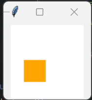

# Graphical : User Guide
## Introduction
Graphical is a program that allows users to easily create digital art by describing an image or animation using our
described syntax. Users may define a scene containing objects that are pre-defined shapes or a set of custom points, and
list fields describing their appearance.

## The Basics
### Basic Grammar
Below is a very basic example of drawing an orange circle on a white canvas:
```
Let orange be an object with shape = circle, size = 30, colour = orange
            
Let canvas be an object with shape = rectangle, colour = (255,255,255), size = (100,100)
            
Let frame be an image on canvas placing orange at (20, 20, 0)
            
DRAW frame
```
Which outputs:


Let's break down each statement line by line:
1. `Let orange be an object with shape = circle, size = 30, colour = orange`: this constructs a circle object, with 
size = 30 and colour = orange called "orange".
2. `Let canvas be an object with shape = rectangle, colour = (255,255,255), size = (100,100)`: this constructs a 
rectangle object which will be the canvas we draw on
3. `Let frame be an image on canvas placing orange at (20, 20, 0)`: this places the orange on top of the canvas at the 
specified location
4. `DRAW frame`: this draws the actual image we saw above


### Creating Shapes (Objects)

All shapes (also known as objects) are created in the same manner:


A few notes on this:
* The shapes that are supported are: `"square", "rectangle", "triangle", "circle", "line"`.
* It does not matter what order you write the object attributes in. For example: `shape = circle, size = 30` and 
`size = 30, shape = circle` will both result in a circle of size 30.
* All shapes are specified with a pair of width and height values: `size = (width, height)` **except** for the circle 
which is just specified by a diameter.

Please see the Appendix for all the attributes that are supported by Graphical.

### Layout & Positioning
Zooming in on the image we just created:


Our orange is placed onto the canvas at the bottom-left of its bounding box. When specifying a position we define the 
x-coordinate first and y-coordinate second like so: `(x,y)`.

### Relative Positioning (Ownership)
We can also place shapes **relative** to other shapes. For example, let's say we wanted to place a black square that is 
located halfway along the width of the circle and a third of the way up.
Since we know that the diameter of the circle is 30, halfway should be 15 and one third should be 10.

```
Let orange be an object with shape = circle, size = 30, colour = orange
Let black_square be an object with shape = square, size = (30, 30), colour = black
            
Let orange own black_square at (15, 10, 0)
        
Let canvas be an object with shape = rectangle, colour = (255,255,255), size = (100,100)
            
Let frame be an image on canvas placing orange at (20, 20, 0)
            
DRAW frame
```

Which outputs: 


Breaking this down, we have:


To do this we introduced two new statements:
1. `Let black_square be an object with shape = square, size = (30, 30), colour = black`: this is the definition of the 
square itself
2. `Let orange own black_square at (15, 0, 1)`: **own** is the keyword that tells the program you wish to define a shape
relative to another, in this case 15 to the right and 10 to the top

Note that this is just for convenience’s sake, we could just have easily created the same image without relative 
ownership and instead just placing both `orange` and `black_square` onto `canvas`.
```
Let orange be an object with shape = circle, size = 30, colour = orange
Let black_square be an object with shape = square, size = (30, 30), colour = black
                    
Let canvas be an object with shape = rectangle, colour = (255,255,255), size = (100,100)
            
Let frame be an image on canvas placing orange at (20, 20, 0) and placing black_square at (35, 30, 1)
            
DRAW frame
```

However, a key benefit in defining ownership is that we only needed to place `orange` onto `canvas`, and `black_square`
was automatically placed as well, because it was owned by `orange`. In the separate case above, we had to place both of 
them.

### Depth
The black square was placed on top of the orange circle because it's depth was `1` whereas the orange's was `0`. 
We can see this by observing the placement statement: 


If we switched the depths around:
```
Let orange be an object with shape = circle, size = 30, colour = orange
Let black_square be an object with shape = square, size = (30, 30), colour = black
                    
Let canvas be an object with shape = rectangle, colour = (255,255,255), size = (100,100)
            
Let frame be an image on canvas placing orange at (20, 20, 1) and placing black_square at (35, 30, 0)
            
DRAW frame
```


### Placement

Every frame can be thought of as a special object type called an _image_. Every frame (or image) has a descriptive name,
and is built on top of an object (such as `canvas`). Every object you wish to place on the scene is done so via a 
`placing` statement:


### Animation

In addition to creating static images via the `DRAW` function, we can also animate between images.
```
Let orange be an object with shape = circle, size = 30, colour = orange
Let black_square be an object with shape = square, size = (30, 30), colour = black
Let canvas be an object with shape = rectangle, colour = (255,255,255), size = (100,100)

Let frame1 be an image on canvas placing orange at (20, 20, 0)
Let frame2 be an image on canvas placing black_square at (35, 30, 0)
Let frame3 be an image on canvas placing orange at (20, 20, 1) and placing black_square at (35, 30, 0)

ANIMATE frame1 -> frame2 -> frame3 FOR 2 seconds
```

Resulting in:


Breaking this down:


### General Tips
We suggest that users break down their programs into distinct steps:
1. **Shape definition**: Start off by defining all the basic shapes that make up your image
2. **Composition**: Once you have your shapes defined, start composing together more complex shapes using ownership
3. **Placement**: Place your shapes onto your canvas
4. **Draw/Animate**: Define your drawing or animation

The composition of object fields is additive (it replaces the field, if the field exists and if the fields is not existent it is set to the new value) meaning that
```
Let orange be an object with shape = circle, size = 30, colour = orange
Let orange be an object with shape = rectangle
Let orange be an object with colour = red
Let orange be an object with rotation = 90 degrees
Let canvas be an object with shape = rectangle, colour = (255,255,255), size = (100,100)
Let frame1 be an image on canvas placing orange at (20, 20, 0)

DRAW frame1
```
The orange object after execution will be a red rectangle, rotated 90 degrees, with size 30. 


This is not true for image fields, for example:
```
Let orange be an object with shape = circle, size = 30, colour = orange
Let canvas be an object with shape = rectangle, colour = (255,255,255), size = (100,100)
Let frame1 be an image on canvas placing orange at (20, 20, 0)
Let frame1 be an image on canvas placing orange at (40, 40, 0)

DRAW frame1
```


The frame drawn will only have one orange on it, and it will be drawn at position (40, 40). 
This is due to the wish to provide a way to completely reassign frames within control flow loops, if the fields were additive for frames, then there would be no way to clear object's from a set image id.

This order is also quite important due to the mutability of certain data-types. As mentioned, the object's fields are mutable, but an image's fields are immutable. This means for proper use order must be established.
For example, in the following snippet, the "orange" object is declared
```
Let orange be an object with shape = circle, size = 30, colour = orange
Let canvas be an object with shape = rectangle, colour = (255,255,255), size = (100,100)
Let frame1 be an image on canvas placing orange at (20, 20, 0)

Let orange be an object with shape = rectangle

DRAW frame1
```


he above Graphical code will render and image of a circular orange, as the copy passed to the image object is the un-mutated version.
However, the code below, where the orange object is modified and then passed to the frame declaration will result in a rectangular orange displayed.
```
Let orange be an object with shape = circle, size = 30, colour = orange
Let orange be an object with shape = rectangle
Let canvas be an object with shape = rectangle, colour = (255,255,255), size = (100,100)
Let frame1 be an image on canvas placing orange at (20, 20, 0)

DRAW frame1
```


These functionalities can be combined into programs that express the mutability and variance in control flow of our language.
```
Let shiftingObject be an object with shape = line, colour = yellow, size = (50,50)
Let shiftingObjectCopy be a shiftingObject
Let canvas be an object with shape = rectangle, colour = white, size = (200,200)
REPEAT
    IF Assert that shiftingObject has shape = rectangle
        THEN { Let shiftingObject be an object with shape = circle }
        ELSE { Let shiftingObject be an object with shape = rectangle }
    IF Assert that shiftingObject has colour = red
        THEN { Let shiftingObject be an object with colour = green }
        ELSE { IF Assert that shiftingObject has colour = yellow
                    THEN { Let shiftingObject be an object with colour = blue }
                    ELSE { IF Assert that shiftingObject has colour = blue
                            THEN { Let shiftingObject be an object with colour = red }
                            ELSE { Let shiftingObject be an object with shape = triangle } } }
    Let frame be an image on canvas placing shiftingObject at (100,100,0), placing shiftingObjectCopy at (0,0,0)
    ANIMATE frame FOR 1 seconds
FOR 4
```
The above program will result in 4 unique control flow paths, and thus create an animation with 4 differing frames despite using the same changing object, and another copy of the object that does not change.

One final important note is that due to the usage of both cross compilation, and the visitor pattern when creating mutable declarations i.e. statements that are intended to modify the state of an object, ensure that the change is different from the existing object, as when compiling into the python script, if a difference is not noted between the mutable declaration and the existing object. 
The compilation into Python will not be able to see the mutation. This is one of the constraints of TKinter scripting that we were unable to hide from the user's experience.

For example, if we modify the above example and change the first declaration of the shiftingObject to be a circle. The example no longer shows any state where the object is displayed as a circle.
This is due to during cross-compilation, the mutable declaration not actually mutating the object from it's "default"/initial value.
```
Let shiftingObject be an object with shape = circle, colour = yellow, size = (50,50)
Let canvas be an object with shape = rectangle, colour = white, size = (200,200)
REPEAT
    IF Assert that shiftingObject has shape = rectangle
        THEN { Let shiftingObject be an object with shape = circle }
        ELSE { Let shiftingObject be an object with shape = rectangle }
    IF Assert that shiftingObject has colour = red
        THEN { Let shiftingObject be an object with colour = green }
        ELSE { IF Assert that shiftingObject has colour = yellow
                    THEN { Let shiftingObject be an object with colour = blue }
                    ELSE { IF Assert that shiftingObject has colour = blue
                            THEN { Let shiftingObject be an object with colour = red }
                            ELSE { Let shiftingObject be an object with shape = triangle } } }
    Let frame be an image on canvas placing shiftingObject at (100,100,0)
    ANIMATE frame FOR 1 seconds
FOR 4
```

## Appendix
### Object Fields
We support the following shapes:
* `shape = square, rectangle, triangle, circle, line`

We support colours in a few ways:
* Using one of `colour = red, black, blue, brown, gray, green, orange, pink, purple, white, yellow`
* Defining it as a hex value in the form `colour = #AABBCC`
* Defining RGB or RGBA values: `colour = (r,g,b), (r,g,b,a)`

Sizes are specified with a pair of width and height values:
* `size = (width, height)` 
* except for the circle which is just
specified by a diameter: `size = diameter`.

Opacity can also be specified using a floating-point number between 0 and 1:
* `opacity = number`

We support rotation of shapes:
* `rotation = number [degrees / radians]`

We support shearing of shapes:
* `sheer = (sheerX, sheerY)`

We support scaling of shapes:
* `scale = (scaleX, scaleY)`

### Conditionals
```
IF predicate
    THEN { exprs* }
    ELSE { exprs* }
```

### Repetition
We can specify that we want an animation to be repeated, take the original animation example of the orange circle and
black square:
```
Let orange be an object with shape = circle, size = 30, colour = orange
Let black_square be an object with shape = square, size = (30, 30), colour = black
Let canvas be an object with shape = rectangle, colour = (255,255,255), size = (100,100)

Let frame1 be an image on canvas placing orange at (20, 20, 0)
Let frame2 be an image on canvas placing black_square at (35, 30, 0)
Let frame3 be an image on canvas placing orange at (20, 20, 1) and placing black_square at (35, 30, 0)

ANIMATE frame1 -> frame2 -> frame3 FOR 2 seconds
```

Suppose we wanted to repeat (or loop) over this animation 5 times, we would change the syntax to:
```
Let orange be an object with shape = circle, size = 30, colour = orange
Let black_square be an object with shape = square, size = (30, 30), colour = black
Let canvas be an object with shape = rectangle, colour = (255,255,255), size = (100,100)

Let frame1 be an image on canvas placing orange at (20, 20, 0)
Let frame2 be an image on canvas placing black_square at (35, 30, 0)
Let frame3 be an image on canvas placing orange at (20, 20, 1) and placing black_square at (35, 30, 0)

REPEAT
    ANIMATE frame1 -> frame2 -> frame3 FOR 2 seconds
FOR 5
```

Breaking this down:


### Complex Example
Multiple ownership, multiple chains
